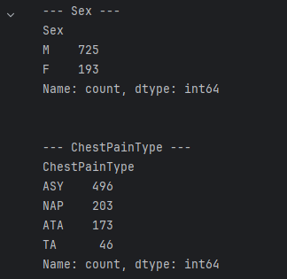
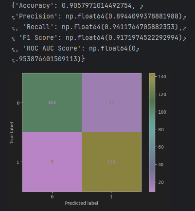
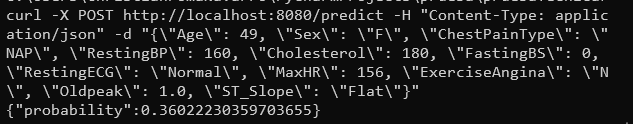
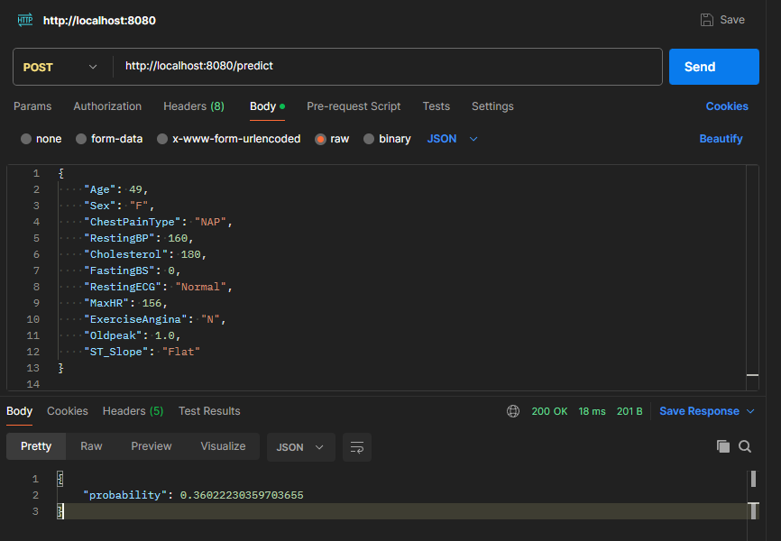

# Modelo de clasificación de ataque al corazón (SVM)

Christian Daniel Poma Navarro

El servicio desplegado se ubica en esta ruta

https://heart-model-cdp-2zs5mbipbq-uc.a.run.app/

## Carga de los datos y exploración

Utilizando el dataset del siguiente URL ``https://www.kaggle.com/datasets/amirmahdiabbootalebi/heart-disease`` donde se realiza la carga de datos utilizando direcciones relativas a la ubicación del archivo y unas cuantas funciones de python para saber algunas características de la data

```py
current_dir = os.getcwd()
data_path = os.path.join(current_dir, '..', 'data', 'heart.csv')
data_path = os.path.abspath(data_path)

data = pd.read_csv(data_path)

print(data.head())
print(data.info())
print(data.describe())
```

Realizando un pequeño análisis de la distribución de las variables categóricas, por ejemplo:



## Preprocesamiento de datos

Dado que poseemos tanto data numérica como categórica, realizamos la separación del nombre de las columnas y creamos un transformer para el tratamiendo de estas variables, siendo un imputer para reemplazar los NULL por la media y la moda y un standardScaler y onehotEncoderEncoder para el tratamiendo de la data númerica y categórica respectivamente. De esa manera generamos el preprocessor que será parte del pipeline

```py
# 2. Preprocesamiento de Datos
categorical_features = ['Sex', 'ChestPainType', 'RestingECG', 'ExerciseAngina', 'ST_Slope']
numeric_features = data.drop(columns=['HeartDisease'] + categorical_features).columns

numeric_transformer = Pipeline(steps=[
    ('imputer', SimpleImputer(strategy='mean')),
    ('scaler', StandardScaler())])

categorical_transformer = Pipeline(steps=[
    ('imputer', SimpleImputer(strategy='most_frequent')),
    ('onehot', OneHotEncoder(handle_unknown='ignore'))])

preprocessor = ColumnTransformer(
    transformers=[
        ('num', numeric_transformer, numeric_features),
        ('cat', categorical_transformer, categorical_features)])
```

## Feature Engineering

Para la parte del feature engineering realizamos un análisis de PCA para reducir la dimensionalidad del modelo hasta una dimensión de 10, teniendo en cuenta que el onehotencoder generó más columnas por la cantidad de variables categóricas encontradas.

## Entrenamiento del modelo

Elaboramos el pipeline el cual estará compuesto por el preprocessor, seguido del feature_engineering (pca) y un clasificador que en este caso será un SVC, fijando la semilla del random_state en 42 para asegurar la reproducibilidad

```py
# 3. Feature Engineering
feature_engineering = Pipeline(steps=[
    ('pca', PCA(n_components=10))
])

# 4. Entrenamiento del Modelo
pipeline = Pipeline(steps=[
    ('preprocessor', preprocessor),
    ('feature_engineering', feature_engineering),
    ('classifier', SVC(probability=True, random_state=42))
])

X = data.drop(columns=['HeartDisease'])
y = data['HeartDisease']

X_train, X_test, y_train, y_test = train_test_split(X, y, test_size=0.3, random_state=42, stratify=y)

pipeline.fit(X_train, y_train)
```

## Evaluación del modelo

Para evaluar el modelo utilizamos distintas métricas, entre ellas el accuracy y el precision para poder decir que tan "bien" predice nuestro modelo

```py
# 5. Evaluación del Modelo
y_pred = pipeline.predict(X_test)
y_prob = pipeline.predict_proba(X_test)[:, 1]

results = {
    'Accuracy': accuracy_score(y_test, y_pred),
    'Precision': precision_score(y_test, y_pred),
    'Recall': recall_score(y_test, y_pred),
    'F1 Score': f1_score(y_test, y_pred),
    'ROC AUC Score': roc_auc_score(y_test, y_prob)
}

pipeline_path = os.path.join('..', 'models', 'pipeline.pkl')
joblib.dump(pipeline, pipeline_path)

print(results)

conf_matrix = confusion_matrix(y_test, y_pred)

cm_display = ConfusionMatrixDisplay(confusion_matrix = conf_matrix, display_labels = [0, 1])
cm_display.plot()
plt.show()
```

Nuestro modelo tiene un accuracy de 0.90579 y una precision de 0.894409 



## Construcción de la API

Para poder generar un api y así consumir un modelo utilizamos un framework de python llamado Flask, de tal manera que generamos dos rutas, utilizamos el decordador de ``@app.route``  en el que está la ruta y el método por usar y la función que utiliza.

```py
@app.route('/')
def hello_world():
	return 'Hello World 2!'


@app.route('/predict', methods=['POST'])
def predict():
	try:
		data = request.json

		required_keys = ['Age', 'Sex', 'ChestPainType', 'RestingBP', 'Cholesterol', 'FastingBS', 'RestingECG', 'MaxHR',
						'ExerciseAngina', 'Oldpeak', 'ST_Slope']
		if not all(key in data for key in required_keys):
			return jsonify({'error': 'Invalid input data'}), 400

		input_data = pd.DataFrame([data])
		proba = pipeline.predict_proba(input_data)
		result = {'probability': float(proba[0][1])}
		logging.info(f"Input data: {data}")
		logging.info(f"Prediction: {result}")
		return jsonify(result)
	except Exception as e:
		logging.error(e)
		return jsonify({'error': str(e)}), 500


if __name__ == '__main__':
	port = int(os.environ.get('PORT', 8080))
	app.run(host='0.0.0.0', port=port)
```

Previamente realizamos la carga del modelo el cual fue exportado e importado usando la librería joblib

```py
model_dir = 'models'
pipeline_path = os.path.join(model_dir, 'pipeline.pkl')

try:
	pipeline = joblib.load(pipeline_path)
except FileNotFoundError:
	logging.error(f"Pipeline not found at {pipeline_path}")
	raise
except Exception as e:
	logging.error(f"Error loading pipeline: {e}")
	raise
```

## Contenerización con Docker

Realizamos la contenerización estableciendo la versión de python y el directorio de trabajo, instalamos curl para el healthcheck y así mantener un monitoreo del servicio , realizamos la copia de la data, los modelos y las pruebas a realizar junto a las dependencias necesarias. Finalmente con ``CMD ["python", "app.py"]`` ejecutamos la aplicación en el puerto 8080

```dockerfile
FROM python:3.9-slim

# Establecer workdir
WORKDIR /app

# Instalar curl
RUN apt-get update && apt-get install -y curl && rm -rf /var/lib/apt/lists/*

# Copiar los archivos de la aplicación al contenedor
COPY app.py /app/

# Copiar data
RUN mkdir -p /app/data
COPY data/heart.csv /app/data/

# Copiar modelos
RUN mkdir -p /app/models
COPY models/pipeline.pkl /app/models/
COPY models/training.ipynb /app/models/

# Copiar pruebas
RUN mkdir -p /app/tests
COPY tests/test_app.py /app/tests/
COPY tests/test_pipeline.py /app/tests/

# Instalar dependencias
COPY requirements.txt /app/
RUN pip install --no-cache-dir -r requirements.txt

# Exponer el puerto
# EXPOSE 8080

# Healthcheck (monitoreo)
HEALTHCHECK --interval=30s --timeout=10s --retries=3 CMD curl --fail http://localhost:${PORT:-8080}/ || exit 1

# Comando
CMD ["python", "app.py"]
```

## Pruebas del servicio

Realizamos las pruebas del servicio de dos maneras, utilizando el comando curl y postman

En el caso de curl en windows utilizamos \" para evitar tener problemas de bad request

```bash
curl -X POST http://localhost:8080/predict -H "Content-Type: application/json" -d "{\"Age\": 49, \"Sex\": \"F\", \"ChestPainType\": \"NAP\", \"RestingBP\": 160, \"Cholesterol\": 180, \"FastingBS\": 0, \"RestingECG\": \"Normal\", \"MaxHR\": 156, \"ExerciseAngina\": \"N\", \"Oldpeak\": 1.0, \"ST_Slope\": \"Flat\"}"
```



Y ahora utilizamos postman para probar el servicio



## Reproduciblidad del modelo

Dado que hemos fijado los random_state en el entrenamiento del modelo y en la separación de las variables de prueba y entrenamiento siempre nos reproducirá el mismo modelo.

## Pruebas unitarias

Instalamos pytest para realizar las pruebas y generamos dos pruebas, el test_pipeline que nos verifica cualquier tipo de prueba realizada con el modelo y el test_app que evalúa la conexión con root y una predicción

test_pipeline.py

```py
import pandas as pd
from sklearn.model_selection import train_test_split
from joblib import load
import os

# Cargar pipeline
current_dir = os.getcwd()
print(current_dir)
pipeline_path = os.path.join(current_dir, 'models', 'pipeline.pkl')
pipeline = load(pipeline_path)

# Cargar dataset
current_dir = os.getcwd()
data_path = os.path.join(current_dir, 'data', 'heart.csv')
data = pd.read_csv(data_path)

# Definimos las variables predictoras y valor a predecir
X = data.drop(columns=['HeartDisease'])
y = data['HeartDisease']

# Creamos un conjunto para pruebas unitarias
X_train, X_test, y_train, y_test = train_test_split(X, y, test_size=0.1, random_state=42, stratify=y)


def test_pipeline_training():
    pipeline.fit(X_train, y_train)
    y_pred = pipeline.predict(X_test)
    assert len(y_pred) == len(y_test)


def test_pipeline_prediction():
    y_pred = pipeline.predict(X_test)
    assert y_pred is not None
    assert len(y_pred) == len(y_test)
```

En este caso como pruebas evaluamos las cantidades de 'y' predichos con la cantidad a evaluar y si es diferente de None la predicción.

Mientras que en test_app.py

```py
import pytest
import sys
import os
from flask import Flask, json

sys.path.insert(0, os.path.abspath(os.path.join(os.path.dirname(__file__), '..')))
from app import app


@pytest.fixture
def client():
    with app.test_client() as client:
        yield client


def test_hello_world(client):
    response = client.get('/')
    assert response.data == b'Hello World 2!'


def test_predict(client):
    input_data = {
        "Age": 40,
        "Sex": "M",
        "ChestPainType": "ATA",
        "RestingBP": 140,
        "Cholesterol": 289,
        "FastingBS": 0,
        "RestingECG": "Normal",
        "MaxHR": 172,
        "ExerciseAngina": "N",
        "Oldpeak": 0,
        "ST_Slope": "Up"
    }

    response = client.post('/predict', json=input_data)
    data = json.loads(response.data)

    assert response.status_code == 200
    assert 'probability' in data
    assert 0.04570 - 10**-5 <= data['probability'] <= 0.04570 + 10**-5

```

Evaluamos el comportamiento el funcionamiento de ambas rutas.

## Monitoreo de la solución

Para realizar un monitoreo de la solución previo al despliegue colocamos un healthcheck que cada 30 segundos compruebe la conexión tneiendo un tiempo de espera de 10 segundos y hasta 3 intentos realizando un curl.

```dockerfile
HEALTHCHECK --interval=30s --timeout=10s --retries=3 CMD curl --fail http://localhost:${PORT:-8080}/ || exit 1
```

## Pipeline CI/CD

En este apartado utilizamos lo que son Github Actions, tomando los push como un activador. Definimos el job que se ejecutará en un contenedor de ubuntu-latest, este realizará un checkout al repositorio, luego configura el python, docker buildx y qemu los cuales se utilizarán en el proceso. Después se realiza la autenticación en google cloud y la configuración del sdk y docker para usar Gcloud, finalmente la construcción de la imagen docker, la ejecución de las pruebas unitarias y la subida de la imagen a google container registry, para así realizar el despliegue.

```yml
name: Deploy GCP

on:
  push:
    branches: [main]

jobs:
  build:
    runs-on: ubuntu-latest

    steps:
      - name: Check out the repository
        uses: actions/checkout@v3

      - name: Set up Python
        uses: actions/setup-python@v4
        with:
          python-version: '3.9'

      - name: Set up Docker Buildx
        uses: docker/setup-buildx-action@v3

      - name: Set up QEMU
        uses: docker/setup-qemu-action@v3

      - name: Authenticate to Google Cloud
        uses: google-github-actions/auth@v1
        with:
          credentials_json: ${{ secrets.GCP_SA_KEY }}

      - name: Set up Google Cloud SDK
        uses: google-github-actions/setup-gcloud@v1
        with:
          project_id: ${{ secrets.GCP_PROJECT_ID }}

      - name: Configure Docker to use gcloud as a credential helper
        run: gcloud auth configure-docker

      - name: Build the Docker image
        run: docker build -t gcr.io/app-heart-model/heart-model-cdp:latest .

      - name: Run unit tests
        run: docker run gcr.io/app-heart-model/heart-model-cdp:latest pytest /app/

      - name: Push to Google Container Registry
        run: docker push gcr.io/app-heart-model/heart-model-cdp

      - name: Deploy to Google Cloud Run
        run: |
          gcloud run deploy heart-model-cdp \
            --image gcr.io/app-heart-model/heart-model-cdp \
            --platform managed \
            --region us-central1 \
            --allow-unauthenticated
```

## Despliegue en cloud

Utilizamos los servicios de google cloud platform (GCP) para realizar el despliegue, en este caso se realiza la creación del proyecto (por interfaz o por consola) y luego la creación de un service account para poder tener los permisos necesarios para el deploy se crea un service account con los permisos de 'Artifact Registry Repository Administrator' para gestionar artefactos como docker images entre otros, Cloud Run Admin que permite gestionar para el despliegue en Google Cloud Run, El service account user permite a esta Service Account usar otras Service Accounts, el Storage Admin para hacer uso del almacenamiento (en este caso las imágenes de docker) y el viewer para poder inspeccionar recursos sin necesidad de modificar nada. 

Utilizamos los comandos que se presentan dentro del job del workflow de github actions para realizar el despliegue cada vez que se requiere.

Los pasos a realizar serían 

- Autenticarse en google cloud

```bash
gcloud auth login
```

- Creación del proyecto

```bash
gcloud projects create <Proyect>
gcloud config set project <Proyect>
```

- Habilitar las APIs necesarias

```bash
gcloud services enable run.googleapis.com containerregistry.googleapis.com cloudbuild.googleapis.com
```

- Construir y subir la imagen docker

``` bash
docker build -t gcr.io/<container_name> .
gcloud auth configure-docker
docker push gcr.io/<container_name>
```

- Desplegarlo desde la imagen

```bash
gcloud run deploy heart-model-cdp \
  --image gcr.io/<container_name> \
  --platform managed \
  --region us-central1 \
  --allow-unauthenticated
```

